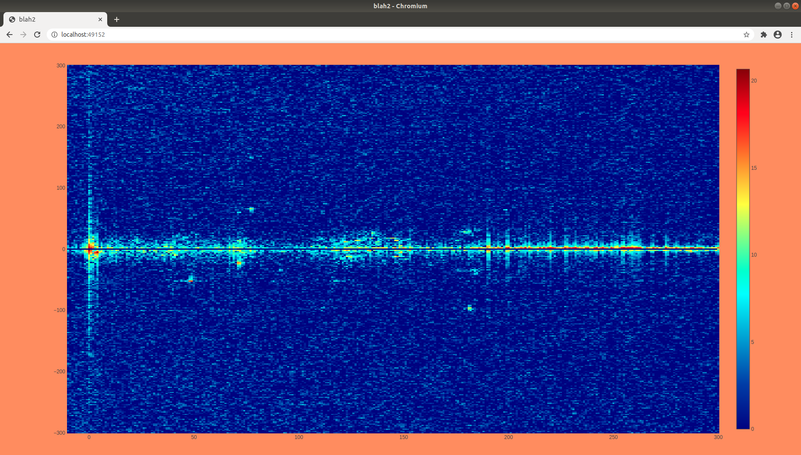

# blah2

A real-time radar which can support various SDR platforms. See a live instance at [http://radar4.30hours.dev](http://radar4.30hours.dev).



## Features

- 2 channel processing for a reference and surveillance signal.
- Designed to be used with external RF source (for passive radar or active radar).
- Outputs delay-Doppler maps to a web front-end.
- Record raw IQ data by pressing spacebar on the web front-end.
- Saves delay-Doppler maps in a JSON array.

## SDR Support

- [SDRplay RSPDuo](https://www.sdrplay.com/rspduo/).
- [USRP](https://www.ettus.com/products/) (only tested on the B210).
- 2x [HackRF](https://greatscottgadgets.com/hackrf/) with clock synchronisation and hardware trigger.
- 2x [RTL-SDR](https://www.rtl-sdr.com/) with clock synchronisation.
- [KrakenSDR](https://www.krakenrf.com/) with 2x channels only.

## Services

The build environment consists of a docker-compose.yml file running the following services;

- The radar processor responsible for IQ capture and processing.
- The API middleware responsible for reading TCP ports for delay-Doppler map data, and exposing this on a REST API.
- The web front-end displaying processed radar data.

## Usage

Building the code using the following instructions; 

- Install docker and docker-compose on the host machine.
- Clone this repository to some directory.
- Install SDRplay API to run service on host.
- Edit the `config/config.yml` for desired processing parameters.
- Run the docker-compose command.

```bash
sudo git clone http://github.com/30hours/blah2 /opt/blah2
cd /opt/blah2
sudo chown -R $USER .
sudo chmod a+x ./lib/sdrplay-3.15.2/SDRplay_RSP_API-Linux-3.15.2.run
sudo ./lib/sdrplay-3.15.2/SDRplay_RSP_API-Linux-3.15.2.run --tar -xvf -C ./lib/sdrplay-3.15.2
cd lib/sdrplay-3.15.2/ && sudo ./install_lib.sh && cd ../../
sudo docker network create blah2
sudo systemctl enable docker
sudo docker compose up -d --build
```

Alternatively avoid building and use the pre-built Docker packages;

```bash
sudo docker pull ghcr.io/30hours/blah2:latest
vim docker-compose.yml
--- build: .
+++ image: ghcr.io/30hours/blah2:latest
sudo docker compose up -d
```

The radar processing output is available on [http://localhost:49152](http://localhost:49152).

## Documentation

- See `doxygen` pages hosted at [http://doc.30hours.dev/blah2](http://doc.30hours.dev/blah2).

## Future Work

- Add a tracker in delay-Doppler space.
- Support for the HackRF/RTL-SDR using a front-end mixer, to sample 2 RF channels in 1 stream.
- Support for the Kraken SDR with all 5 channels.
- Add [SoapySDR](https://github.com/pothosware/SoapySDR) support for the [C++ API](https://github.com/pothosware/SoapySDR/wiki/Cpp_API_Example) to include a wide range of SDR platforms.

## FAQ

- If the SDRplay RSPduo does not capture data, restart the API service (on the host) using the script `sudo ./script/blah2_rspduo_restart.bash`.

## Contributing

Pull requests are welcome - especially for adding support for a new SDR. 

- Currently have an issue where the USRP B210 is timing out after 5-10 mins and crashes the code. Convinced it's an issue with my usage of the API - contact me for more info.

## Links

- Join the [Discord](https://discord.gg/ewNQbeK5Zn) chat for sharing results and support.

- Watch a [Youtube video](https://www.youtube.com/watch?v=FF2n28qoTQM) showing the hardware and software setup.

## License

[MIT](https://choosealicense.com/licenses/mit/)
