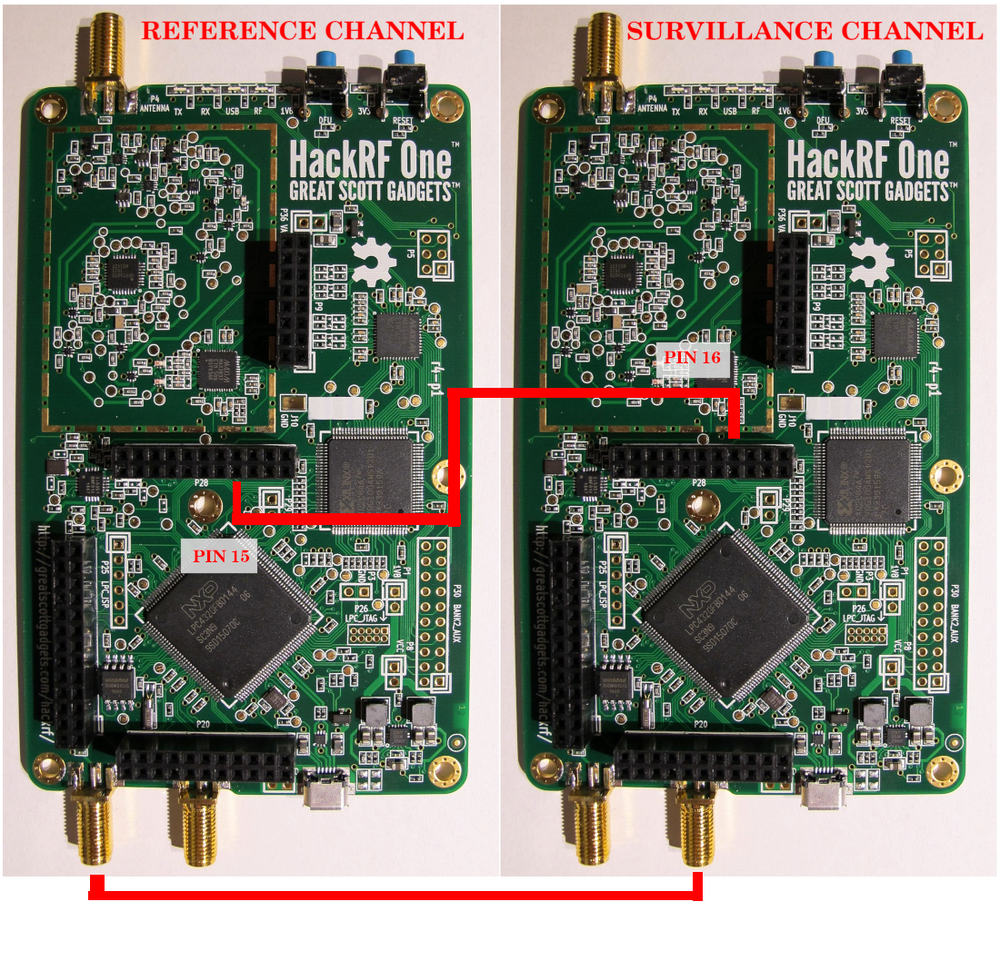

# HackRF setup for blah2

This requires 2 HackRF units with a shared clock signal and a shared hardware trigger.

## Instructions

- The two HackRF boards should be wired similarly to the below wiring diagram

- (Optional read) Here is the official [guide](https://hackrf.readthedocs.io/en/latest/hardware_triggering.html) on how to set up the shared clock and hardware trigger.
- Install the HackRF package on the host using `sudo apt install hackrf` to access HackRF tools.
- Run `hackrf_info` to get HackRF serial numbers.
- Edit the `config/config-hackrf.yml` file to add serial numbers and parameters.
- Update the `docker-compose.yml` file to use the above config file in both locations.
